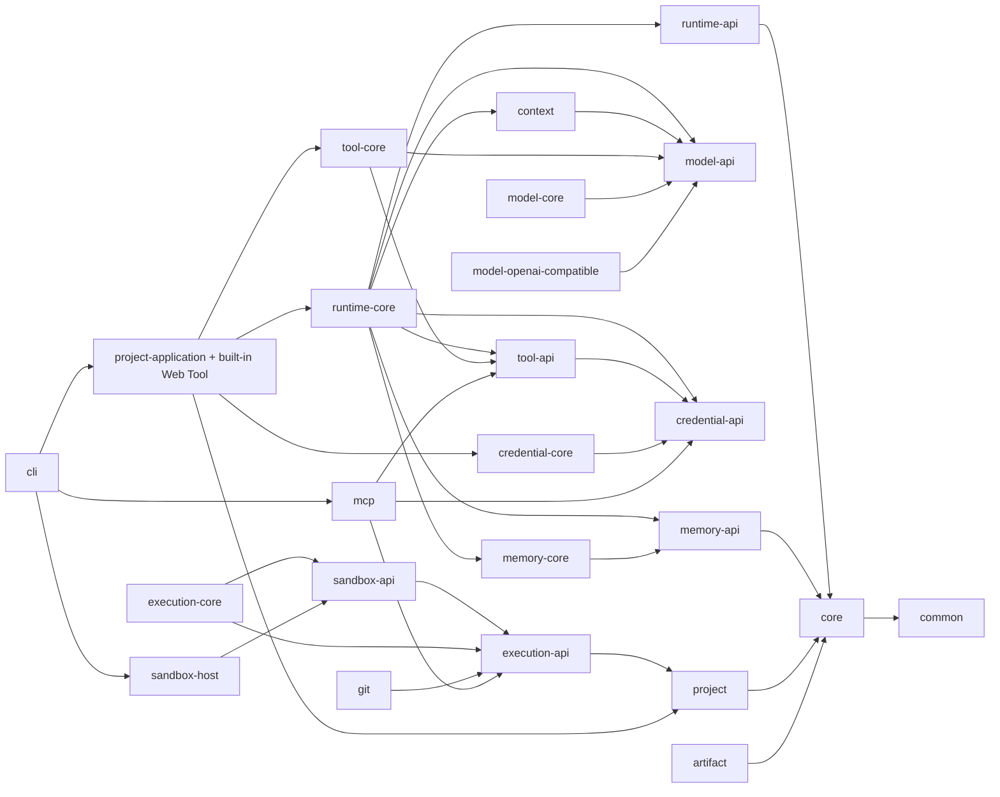

# Haifa Agent

Haifa Agent 是面向 Java 生态的通用 Agent Runtime 与产品开发平台。当前版本为 `0.1.0-SNAPSHOT`，使用 Java 21 与 Maven Wrapper 3.9.15。

## 当前已实现

- Core 领域模型、`AgentRun` 状态机、Runtime API 与异步 AgentLoop；
- Provider-neutral 的 Model、Tool、Credential、Memory 与 Context 契约；
- DeepSeek、阿里云百炼、火山方舟的 OpenAI-compatible Chat Completions 适配，支持流式输出、Tool Call、最终 usage 和受保护的 reasoning continuation；
- 冻结 Tool Binding、受限 JSON Schema 校验、短生命周期凭据租约与 AES-GCM 本地凭据存储；
- 固定协议 `2025-11-25` 的 MCP Client，支持 Streamable HTTP 与由 `ExecutionBroker` 托管的 stdio；
- 可冻结的 `web.search` / `web.fetch` Tool：Search 支持 Aliyun、Brave、Tavily，Fetch 当前只支持 Aliyun；
- Project/Workspace 的受控文件访问、变更集、补丁、索引、快照与显式 Artifact 导出；
- ExecutionBroker、Sandbox SPI、受控 Host Provider，以及只读 Git 适配；
- Project Application 和本地一次性 Coding Agent CLI。

尚未实现的能力不应被视为当前行为，包括 Enterprise SDK、Server/Worker/Admin、Skill、Knowledge、Graph、Policy 独立模块、持久化 Store，以及容器或 microVM Sandbox。

## 当前 Reactor

```text
build-support/
  haifa-agent-bom/
  haifa-agent-spring-bom/
haifa-agent-contract/
haifa-agent-kernel/
  haifa-agent-common/
  haifa-agent-core/
  haifa-agent-runtime-api/
  haifa-agent-context/
  haifa-agent-project/
  haifa-agent-artifact/
  haifa-agent-runtime-core/
haifa-agent-execution/
  haifa-agent-execution-api/
  haifa-agent-sandbox-api/
  haifa-agent-execution-core/
  haifa-agent-sandbox-host/
haifa-agent-capabilities/
  haifa-agent-credential-api/
  haifa-agent-credential-core/
  haifa-agent-tool-api/
  haifa-agent-tool-core/
  haifa-agent-model-api/
  haifa-agent-model-core/
  haifa-agent-memory-api/
  haifa-agent-memory-core/
haifa-agent-integrations/
  haifa-agent-model-openai-compatible/
  haifa-agent-git/
  haifa-agent-mcp/
haifa-agent-applications/
  haifa-agent-project-application/
  haifa-agent-cli/
```

实线表示编译期依赖，箭头从使用方指向被依赖方：



## 关键边界

- `common`、`core`、`runtime-api`、`context`、`project`、`artifact`、各 Capability API、Execution API 和 Sandbox API 保持纯 Java；
- `AgentRun` 生命周期只由 Core 的命名领域行为决定，Runtime 不维护第二份状态转换表；
- Runtime 只依赖 API/SPI，不依赖具体模型、MCP 或 Sandbox Provider；
- 凭据明文只在短生命周期 `CredentialLease` 中使用，不进入 Prompt、Tool 参数、Checkpoint、Trace 或 Workspace；
- 对模型暴露的 Tool alias 与内部精确坐标分离；Run 创建后冻结 Tool Binding 与模型快照；
- Host Sandbox 是受控执行，不等同于网络、CPU、内存或文件系统强隔离。

## 构建与验证

Windows PowerShell：

```powershell
.\mvnw.cmd test
.\mvnw.cmd -pl :haifa-agent-runtime-core -am test
.\mvnw.cmd --batch-mode --no-transfer-progress -T 1C -Pci-fast clean verify
```

普通开发与 CI 不运行真实模型、外部 MCP 或 Web Provider 服务。DeepSeek 与 Web Live Test 都必须使用各自的显式开关和独立凭据，访问外部服务并可能产生费用。

## 架构文档

- [架构基线](docs/architecture-baseline.md)
- [当前模块与依赖](docs/02-repository-modules-and-dependencies.md)
