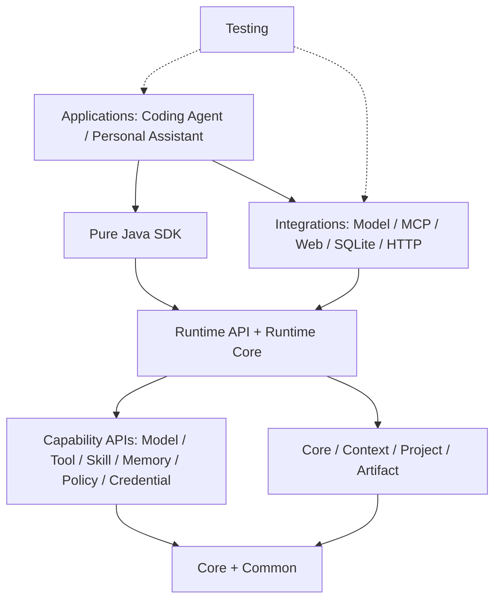

# Haifa Agent

[](https://github.com/haifa-agent/haifa-agent/actions/workflows/feature-pr-fast.yml)


Haifa Agent 是面向 Java 与 Spring 生态的通用 Agent Runtime、SDK 和产品开发平台。它把模型调用、
Tool、MCP、Skill、Memory、Workspace、Policy、Credential、持久化与恢复放进同一套可测试、可冻结、
可审计的运行语义中，帮助 Java 应用从一次模型请求演进为可以长期运行和治理的 Agent 产品。

> **项目状态**：当前版本为 `0.1.0-SNAPSHOT`，仍处于活跃开发阶段。本文只描述当前源码、POM 和测试中
> 已落地的能力；未实现范围在文末单独列出。

## 为什么使用 Haifa Agent

直接调用模型 API 很容易；困难的是让包含模型、工具和业务状态的长流程在失败、重启、审批和配置变化后
仍然保持确定的语义。Haifa Agent 重点解决这些运行期问题：

- **可恢复的 Agent Run**：同步接收请求、异步执行 Run，通过 Attempt、Checkpoint、Interaction、
  Run Input 和 Event Journal 支持暂停、审批、恢复与终态收敛。
- **冻结而不是猜测**：Run 创建时冻结 Definition、模型快照、Tool/Skill Binding、产品配置和预算；
  历史 Run 不受后续目录或配置变化影响。
- **统一的能力管线**：Java Tool、远端 MCP Tool、Skill 激活、Web Tool 和执行能力都进入同一套
  Catalog、Schema、Policy、Credential、Journal 与恢复边界。
- **Java 优先，Spring 可选**：Core、Runtime、SDK 和主要 Capability 保持纯 Java；Spring Boot
  Starter 只负责配置、Bean 收集和生命周期适配。
- **面向产品而不绑定单一产品**：同一个 Runtime 与 SDK 已用于 Coding Agent、Personal Assistant
  和独立消费者示例，产品语义留在 Application 层。
- **安全边界显式可见**：凭据只通过短生命周期 Lease 使用；高风险动作受 Policy/Approval 约束；
  Host、Local Native 和未来更强 Sandbox 的能力边界不会被混为一谈。

## 核心概念

| 概念 | 在 Haifa Agent 中的含义 |
| --- | --- |
| `AgentDefinition` | Agent 的版本化定义。Run 创建时冻结其版本引用，不随运行中配置变化漂移。 |
| `ProductProfile` | 可信宿主声明的产品边界，包括模型、预算、限制、指令和 Capability allowlist。 |
| `HaifaAgent` | 已完成装配、由宿主持有并负责资源生命周期的 Runtime 实例，不是某一次 Run。 |
| Conversation / Session | 面向用户的多轮容器；可以包含多个 Run，但同一会话最多只有一个活动 Run。 |
| `AgentRun` | 一次权威执行及其状态机；`AgentRunSnapshot` 是运行视图，`AgentRunResult` 是最终结果。 |
| Attempt / Checkpoint | Run 的物理执行尝试与可恢复状态。恢复会重新校验冻结 Binding 和外部能力。 |
| Tool / MCP / Skill | Tool 是统一执行单元；MCP Tool 先经本地审查再导入；Skill 通过渐进披露按需激活。 |
| Artifact | 显式导出的、内容寻址且带 provenance 的结果，不等同于 Workspace 文件。 |

Run 的主要生命周期由 Core 统一约束：

```text
PENDING -> QUEUED -> RUNNING
RUNNING -> SUSPENDING -> SUSPENDED -> RUNNING
RUNNING -> WAITING_INTERACTION / WAITING_APPROVAL -> RUNNING
RUNNING -> COMPLETING -> COMPLETED
非终态 -> FAILED / CANCELLED / TIMEOUT
```

Runtime 负责协调，不能复制或绕过这套状态机。

## 快速开始

### 前置条件

- JDK 21；
- Git；
- 使用仓库自带 Maven Wrapper，无需预装 Maven；
- 只有运行真实模型示例时才需要 `DEEPSEEK_API_KEY`。

### 运行第一个 Agent

克隆仓库：

```bash
git clone https://github.com/haifa-agent/haifa-agent.git
cd haifa-agent
```

macOS / Linux：

```bash
export DEEPSEEK_API_KEY="<your-api-key>"
./mvnw -pl :haifa-agent-sdk-example -am \
  compile org.codehaus.mojo:exec-maven-plugin:3.5.1:java \
  -Dexec.mainClass=io.haifa.example.sdk.basic.HelloHaifa
```

Windows PowerShell：

```powershell
$env:DEEPSEEK_API_KEY = '<your-api-key>'
.\mvnw.cmd -pl :haifa-agent-sdk-example -am `
  compile org.codehaus.mojo:exec-maven-plugin:3.5.1:java `
  '-Dexec.mainClass=io.haifa.example.sdk.basic.HelloHaifa'
```

示例背后的 Java 代码只有一次构建和一次调用：

```java
import io.haifa.agent.starter.HaifaAgentStarter;

try (var haifa = HaifaAgentStarter.create()) {
    System.out.println(haifa.chat("Hello, Java!").await().text());
}
```

默认 Starter 使用 DeepSeek V4 Flash、关闭 Thinking，并采用进程内 Runtime Persistence 与
Conversation Store。它默认不启用文件、Shell、Git、MCP、Web、Memory、Artifact 或 Execution；
进程退出后状态会丢失。真实调用会访问外部服务并可能产生费用。

### 注册类型化 Java Tool

应用可以用 Java record 定义 Tool 输入输出，不必手写 Catalog、Binding、Schema Codec 或 Invoker：

```java
public final class WeatherTool
        implements JavaTool<WeatherTool.Request, WeatherTool.Response> {

    public record Request(String city) {}
    public record Response(String forecast) {}

    private static final JavaToolSpec<Request, Response> SPEC =
            JavaToolSpec.builder("weather.get", Request.class, Response.class)
                    .alias("weather_get")
                    .description("Get the current weather for a city")
                    .pure()
                    .build();

    @Override
    public JavaToolSpec<Request, Response> spec() {
        return SPEC;
    }

    @Override
    public Response invoke(Request input, JavaToolContext context) {
        return new Response(weatherClient.current(input.city()));
    }
}
```

把 Tool 加入 Starter 后，调用仍会经过统一 Tool Pipeline：

```java
try (var agent = HaifaAgentStarter.builder()
        .name("weather-agent")
        .instructions("Use weather_get for weather questions.")
        .tool(new WeatherTool())
        .build()) {
    var response = agent.chat("What is the weather in Shanghai?").await();
    System.out.println(response.text());
}
```

### 获取类型化最终结果

对支持 `STRUCTURED_OUTPUT` 的模型，可以把有界 Java record 冻结为本次 Run 的最终输出契约：

```java
public record TripPlan(String city, int days, List<String> activities) {}

var response = agent.chat("Plan a two-day trip.", TripPlan.class).await();
TripPlan plan = response.value();
```

Provider Adapter 映射结构化输出协议，Runtime 校验并持久化最终结果后，SDK 才解码 record。中间流、
Tool Call 或未经校验的 JSON 文本不会被伪装成类型化结果。

## 接入现有项目

当前版本尚未作为稳定版发布。先从仓库根目录把匹配版本制品安装到本地 Maven 仓库：

```bash
./mvnw \
  -pl :haifa-agent-bom,:haifa-agent-spring-bom,:haifa-agent-sdk-starter,:haifa-agent-spring-boot-starter \
  -am -DskipTests install
```

### Pure Java

```xml
<dependencyManagement>
    <dependencies>
        <dependency>
            <groupId>io.haifa</groupId>
            <artifactId>haifa-agent-bom</artifactId>
            <version>0.1.0-SNAPSHOT</version>
            <type>pom</type>
            <scope>import</scope>
        </dependency>
    </dependencies>
</dependencyManagement>

<dependencies>
    <dependency>
        <groupId>io.haifa</groupId>
        <artifactId>haifa-agent-sdk-starter</artifactId>
    </dependency>
</dependencies>
```

### Spring Boot

```xml
<dependencyManagement>
    <dependencies>
        <dependency>
            <groupId>io.haifa</groupId>
            <artifactId>haifa-agent-spring-bom</artifactId>
            <version>0.1.0-SNAPSHOT</version>
            <type>pom</type>
            <scope>import</scope>
        </dependency>
    </dependencies>
</dependencyManagement>

<dependencies>
    <dependency>
        <groupId>io.haifa</groupId>
        <artifactId>haifa-agent-spring-boot-starter</artifactId>
    </dependency>
</dependencies>
```

Spring Boot Starter 默认创建单例 `HaifaAgent`，自动收集 `JavaTool` Bean，支持有序
`HaifaAgentStarterCustomizer`，并在应用关闭时释放 Agent。它不会把 Spring AI 或 Provider SDK
引入纯 Java Core、Runtime 或 SDK。

完整的外部消费者应用位于 [`examples/haifa-agent-example`](examples/haifa-agent-example/README.md)，
分别展示 Pure Java 与 Spring Boot 接入。

## 已实现能力

### Runtime 与模型

- Core 领域模型、`AgentRun` 状态机、Runtime API、异步 AgentLoop、Attempt、Checkpoint、
  Interaction、Run Input、Plan/Todo 和完成门禁；
- Provider-neutral Model API，以及确定性模型目录、选择、访问策略、健康状态和 Adapter Registry；
- OpenAI-compatible Adapter 支持同步与 SSE、Tool Call、最终 usage、结构化输出和受保护的
  reasoning continuation；
- Google Gemini Integration 支持官方 `generateContent` / `streamGenerateContent` 文本、Function Calling、
  结构化输出、原生 inline 图片/音频、Usage 和受保护 Thought Signature continuation；Antigravity Direct
  仅作为独立方言；
- 已治理的 OpenAI、DeepSeek、阿里云百炼、Kimi、智谱和火山方舟接入，覆盖当前已验证的
  Chat Completions、Responses 与 Anthropic Messages Binding；
- 不进行隐式模型 fallback、轮询或运行中热替换。

### Tool、MCP、Skill 与 Web

- 类型化 `JavaTool<I, O>`、Java record Schema/Codec、受限 JSON Schema Draft 2020-12 子集、
  精确 Tool Binding 和统一 Tool Catalog；
- 固定协议 `2025-11-25` 的 MCP Client，支持 Streamable HTTP 与由 `ExecutionBroker` 托管的 stdio；
- 兼容 `SKILL.md` 的 Skill API/Core/Base，支持分层发现、内容寻址冻结、摘要披露、Run 级激活和
  资源按需读取；
- 共享 `git` / `github` CLI Skill，以及 Coding `git-delivery` 和 Personal Assistant
  `github-project-watch` Product Skill；Skill 只提供流程，不授予执行、网络或 Credential 权限；
- `web.search` 支持 Aliyun IQS、Brave、Tavily；`web.fetch` 支持 Aliyun IQS、Browserless、Tavily；
- MCP Tool 和 Skill 激活不会绕过 Runtime Tool Pipeline，也不能扩大 Run 已冻结的 Tool 集。

### Context、Memory 与持久化

- 分层 Context IR、受控压缩与安全的 Prompt Diagnostics；诊断只返回组件、顺序、摘要和 Token 估算，
  不返回 Prompt、用户消息、Memory 或 Tool 正文；
- Run、Session、User Scope 的 Memory API/Core，以及 SQLite 中全人工确认的 Candidate、正式 Memory
  和最小 Audit；
- SQLite V1～V7 Migration、版本化 Codec、线程绑定 UoW、完整 Runtime Persistence Port、
  Conversation、Policy/Approval/Trust 与 Artifact 单机存储；
- JSONL 是可删除、可重建的安全 Transcript Outbox 投影，不是恢复事实源。

### Project、Execution 与安全

- 受控 Workspace 多根目录授权、安全文件操作、`SessionChangeLedger` 纯内存变更账本、Patch、索引与 Snapshot；
- 显式 Artifact Export、内容寻址 payload、provenance、完整性校验与 SQLite 单机持久化；
- `ExecutionBroker`、Sandbox SPI、受控 Host Provider，以及 macOS Seatbelt / Linux bubblewrap
  Local Native Provider；
- 模型通过受控 `execution.run` 直接调用系统 `git` / `gh`；Java Git Integration 只保留不向模型披露的
  Worktree、Patch 合并和最小 Revision Probe，不再注册 `git.*` / `github.*` 子命令 Tool；
- 请求绑定的 Policy Decision、`DENY > ASK > ALLOW`、Approval Grant、Project Trust、AES-GCM
  本地 Credential Store 与短生命周期 Lease。

### SDK、协议与产品

- 纯 Java `haifa-agent-sdk` Facade、可信 `ProductProfile`、确定性 Capability Contribution 装配、
  Conversation/Run API、轻量 `chat()` 和类型化最终输出；
- Spring Boot Starter 与自动装配；
- 公共 Contract、持久 Run Event Feed，以及框架中立 HTTP/JSON + SSE 参考 Adapter；
- 可恢复的 Coding Session、tui4j Terminal 和唯一可执行 CLI；
- Personal Assistant 的纯 Java Application、本机 loopback-only Spring Boot WebFlux Server、
  React Web、只读诊断 Admin、持久 Mission 与精简 Deep Research Product Skill；
- Reactor 末端的 Test Harness、共享 Fixture、Transport TCK、Integration、Live 与 E2E 测试模块。

## 架构


```mermaid
flowchart TB
  APP["Applications: Coding Agent / Personal Assistant"] --> SDK["Pure Java SDK"]
  APP --> INTEGRATIONS["Integrations: Model / MCP / Web / SQLite / HTTP"]
  SDK --> RUNTIME["Runtime API + Runtime Core"]
  INTEGRATIONS --> RUNTIME
  RUNTIME --> CAP["Capability APIs: Model / Tool / Skill / Memory / Policy / Credential"]
  RUNTIME --> KERNEL["Core / Context / Project / Artifact"]
  CAP --> CORE["Core + Common"]
  KERNEL --> CORE
  TESTING["Testing"] -.-> APP
  TESTING -.-> INTEGRATIONS
```

固定原则：高层可以依赖低层，低层不能反向依赖高层；Application 负责装配，不把产品语义回灌到
Core、Runtime 或 Capability API。Spring Framework 从适配边界开始引入，Spring Boot 只进入 Starter
和最高层 Application。

仓库按职责分为：

| 目录 | 职责 |
| --- | --- |
| `haifa-agent-kernel/` | Common、Core、Runtime、Context、Project 与 Artifact。 |
| `haifa-agent-capabilities/` | Model、Tool、Skill、Credential、Memory 与 Policy API/Core。 |
| `haifa-agent-execution/` | Execution、Sandbox SPI 与本地 Provider。 |
| `haifa-agent-integrations/` | 模型、Web、MCP、Git、SQLite、JSONL 与 HTTP Adapter。 |
| `haifa-agent-sdk/`、`haifa-agent-sdk-starter/` | 高层纯 Java Facade 与安全默认 Quickstart。 |
| `haifa-agent-spring/` | Spring Boot 自动装配与依赖 Starter。 |
| `haifa-agent-applications/` | Coding Agent、CLI、Personal Assistant、SDK 示例与 Runtime Demo。 |
| `haifa-agent-testing/` | Reactor 末端的 Harness、Fixture、TCK、Integration 与 E2E。 |
| `examples/haifa-agent-example/` | 不加入 Reactor 的独立消费者构建。 |

详细模块、依赖方向和稳定边界以
[`docs/architecture-baseline.md`](docs/architecture-baseline.md) 为准。

## 示例与产品入口

| 入口 | 适合场景 | 默认网络行为 |
| --- | --- | --- |
| [`haifa-agent-sdk-starter`](haifa-agent-sdk-starter/README.md) | 最小 Pure Java 接入 | `chat()` 使用真实 DeepSeek，需显式提供凭据 |
| [`haifa-agent-sdk-example`](haifa-agent-applications/haifa-agent-sdk-example/README.md) | 从 Basic 到 Advanced 学习 SDK | 除 `HelloHaifa` 外默认离线 |
| [`examples/haifa-agent-example`](examples/haifa-agent-example/README.md) | 验证外部 Pure Java / Spring Boot 消费方式 | 测试离线，运行应用需凭据 |
| [`haifa-agent-runtime-demo`](haifa-agent-applications/haifa-agent-runtime-demo/README.md) | 直接观察 Runtime、Tool、MCP、Skill 装配 | 真实调用必须显式 opt-in |
| [`haifa-agent-cli`](haifa-agent-applications/haifa-agent-cli/README.md) | 本地 Coding Agent Terminal 与 one-shot | 由显式配置决定 |
| [`haifa-agent-personal-assistant-server`](haifa-agent-applications/haifa-agent-personal-assistant-server/README.md) | 本机 Personal Assistant API / SSE | loopback-only，外部能力显式配置 |

## 构建与测试

普通测试默认不访问真实模型、MCP 或 Web Provider。真实调用必须设置对应的显式开关与凭据，并可能
产生费用。

macOS / Linux：

```bash
# 精确测试，L1 默认串行
./build-support/scripts/invoke-haifa-maven.sh --layer L1 -- \
  -pl :haifa-agent-runtime-core -am \
  -Dtest=RuntimeCoreTest -Dsurefire.failIfNoSpecifiedTests=false test

# 受影响模块完整测试，L2 固定 -T 4
./build-support/scripts/invoke-haifa-maven.sh --layer L2 -- \
  -pl :haifa-agent-runtime-core -am test

# 全仓 Unit / Contract / Architecture
./build-support/scripts/invoke-haifa-maven.sh --layer L2 -- test

# 本地最终门禁，L3 固定 -T 2
./build-support/scripts/invoke-haifa-maven.sh --layer L3 -- -Pci-fast clean verify

# 显式执行默认排除的慢速 Surefire 测试
./build-support/scripts/invoke-haifa-maven.sh --layer L2 -- -Pslow-tests test
```

Windows PowerShell：

```powershell
.\build-support\scripts\invoke-haifa-maven.ps1 --layer L1 '--' `
  -pl :haifa-agent-runtime-core -am `
  '-Dtest=RuntimeCoreTest' '-Dsurefire.failIfNoSpecifiedTests=false' test

.\build-support\scripts\invoke-haifa-maven.ps1 --layer L2 '--' `
  -pl :haifa-agent-runtime-core -am test

.\build-support\scripts\invoke-haifa-maven.ps1 --layer L2 '--' test

.\build-support\scripts\invoke-haifa-maven.ps1 --layer L3 '--' -Pci-fast clean verify

.\build-support\scripts\invoke-haifa-maven.ps1 --layer L2 '--' -Pslow-tests test
```

普通 Surefire、L2 和 L3 `ci-fast` 默认排除类级 `@Tag("slow")`；当前慢测集合及精确运行方式见
[`build-support/README.md`](build-support/README.md)。测试代码仍由 `slow-tests` Profile 显式执行。

同一 SHA 已通过 `ci-fast` 后，可使用 `-Pci-integration-only verify` 只运行 Failsafe Integration。
Release 验证必须通过 `-pl` 指定受影响模块；完整分层矩阵见
[`build-support/README.md`](build-support/README.md)。

## 当前未实现

以下能力不应被视为当前行为：

- Enterprise SDK、通用生产级 HTTP Server、Worker、Scheduler、Control Plane 和企业 Admin Server；
- 分布式 Store/Lease、生产 KMS/Vault、对象存储和跨机器恢复；
- Knowledge/RAG、Graph/Workflow 与多 Agent 调度；
- Skill Hub、Skill 创作/安装/企业管理面和动态插件平台；
- 完整的 Project Trust/Approval 产品体验与企业审批流程；
- Windows Local Native Adapter、容器、gVisor、microVM 或 Kubernetes Sandbox；
- Coding Session Tree/Fork/Clone、PTY、交互式子进程和后台 Job；
- MCP Server Hosting，以及 MCP Resources、Prompts、Sampling、Elicitation、OAuth 等后续协议能力。

Personal Assistant Server 是受信本机、仅监听 loopback 的具体产品宿主，不能据此视为通用生产 Server。
Host Sandbox 是可信本地受控执行，也不等同于网络、CPU、内存或文件系统强隔离。

## 文档

- [架构基线](docs/architecture-baseline.md)
- [产品定位与总体架构](docs/01-product-positioning-and-overall-architecture.md)
- [当前模块与依赖](docs/02-repository-modules-and-dependencies.md)
- [Runtime 与 AgentLoop](docs/04-agent-runtime-and-agent-loop.md)
- [Tool、MCP 与 Skill 实现总览](docs/07-implementation-overview.md)
- [持久化与存储架构](docs/08-persistence-and-storage-architecture.md)
- [SDK 基建与多产品演进路线](docs/roadmap/sdk-foundation-and-multi-product-roadmap.md)
- [Agent 产品文档索引](docs/products/README.md)
- [已知待办](docs/00-to-do-note.md)

## 参与开发

开始修改前请阅读 [`AGENTS.md`](AGENTS.md) 和受影响模块的 `README.md`、`pom.xml`、架构测试。
功能开发使用 `feat-*` 分支，并向 `dev` 发起 Pull Request。提交前至少完成受影响模块测试；最终交付应在
同一 Git SHA 上通过 `-Pci-fast clean verify`，或明确记录未完成验证及原因。

`docs/` 与 `test-config/` 是独立 Git 仓库，不参与主仓暂存、提交和 Pull Request。真实 Provider 测试
不得输出 API Key、完整 Prompt、原始供应商响应或其他敏感内容。
