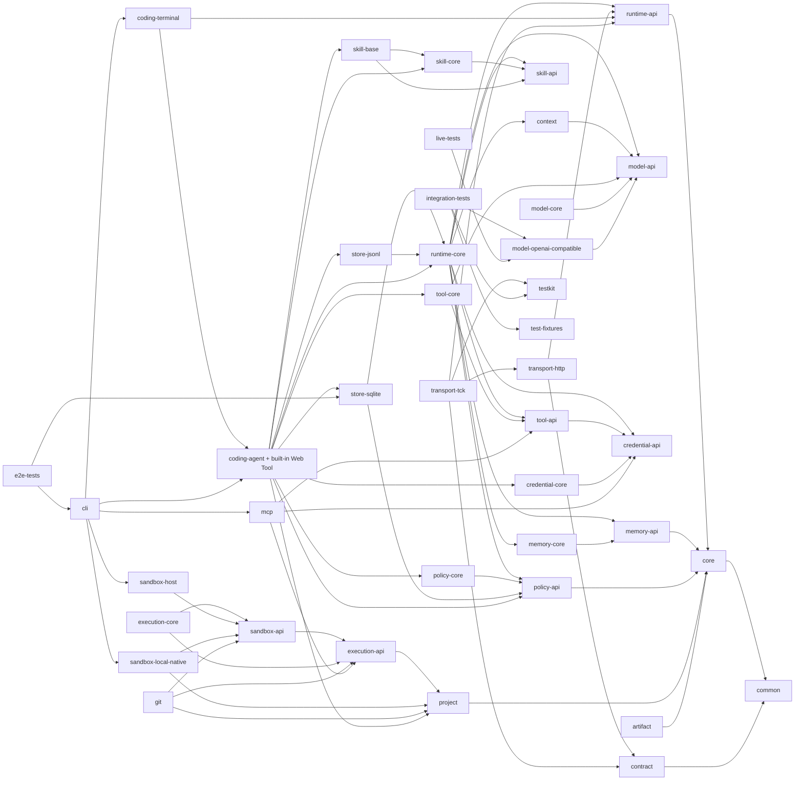

# Haifa Agent

Haifa Agent 是面向 Java 生态的通用 Agent Runtime 与产品开发平台。当前版本为 `0.1.0-SNAPSHOT`，使用 Java 21 与 Maven Wrapper 3.9.15。

## 当前已实现

- Core 领域模型、`AgentRun` 状态机、Runtime API 与异步 AgentLoop；
- Provider-neutral 的 Model、Tool、Skill、Credential、Memory 与 Context 契约；
- DeepSeek、阿里云百炼、火山方舟的 OpenAI-compatible Chat Completions 适配，支持流式输出、Tool Call、最终 usage 和受保护的 reasoning continuation；
- 冻结 Tool Binding、受限 JSON Schema 校验、短生命周期凭据租约与 AES-GCM 本地凭据存储；
- 固定协议 `2025-11-25` 的 MCP Client，支持 Streamable HTTP 与由 `ExecutionBroker` 托管的 stdio；
- 兼容 `SKILL.md` 的 Skill API/Core/Base，支持分层发现、内容寻址冻结、摘要披露、Run 级受控激活和资源按需读取；
- 可冻结的 `web.search` / `web.fetch` Tool：Search 支持 Aliyun、Brave、Tavily，Fetch 当前只支持 Aliyun；
- Project/Workspace 的受控文件访问、变更集、补丁、索引、快照与显式 Artifact 导出；
- ExecutionBroker、Sandbox SPI、受控 Host Provider、macOS Seatbelt/Linux bubblewrap Local Native
  Provider，以及只读 Git 适配；
- SQLite V1～V4 Migration、版本化 Codec、线程绑定 UoW、完整 Runtime Persistence Port、持久
  Interaction/Run Input/Event Journal、事务恢复与故障收敛；
- 可选的安全 JSONL Transcript 投影，支持 at-least-once 去重、截断诊断、跨进程锁与原子轮转；
- 纯 Java Policy API/Core，支持请求绑定决策、`DENY > ASK > ALLOW`、受限 Approval Grant、
  Project Trust、产品验证 SPI 和内存 Store；SQLite V3 已提供 Snapshot、Decision、Evidence、
  Grant 与 Trust 的权威持久化，Runtime Tool、Coding Agent 与 ExecutionBroker 共享同一 Decision；
- 公共 Contract、持久 Interaction/Steer/Run Event Feed、框架中立 HTTP/JSON + SSE 参考 Adapter，
  以及 Reactor 末端的 Transport TCK；
- Coding Agent 产品模块、严格映射评审原型的 JLine Terminal 与唯一可执行 CLI；CLI 支持交互
  Terminal、兼容的 one-shot 模式，并可显式选择 `MEMORY`、`SQLITE` 或 `SQLITE_WITH_JSONL`。

尚未实现的能力不应被视为当前行为，包括 Enterprise SDK、生产 Server/Worker/Admin、Skill
Hub/创作与企业管理面、Knowledge、Graph、完整的 Project Trust/Approval 产品体验、分布式
Store/Lease、生产 KMS/Vault、Windows Local Native Adapter、容器或 microVM Sandbox。

## 当前 Reactor

```text
build-support/
  haifa-agent-bom/
  haifa-agent-spring-bom/
haifa-agent-contract/
haifa-agent-kernel/
  haifa-agent-common/
  haifa-agent-core/
  haifa-agent-runtime-api/
  haifa-agent-context/
  haifa-agent-project/
  haifa-agent-artifact/
  haifa-agent-runtime-core/
haifa-agent-execution/
  haifa-agent-execution-api/
  haifa-agent-sandbox-api/
  haifa-agent-execution-core/
  haifa-agent-sandbox-host/
  haifa-agent-sandbox-local-native/
haifa-agent-capabilities/
  haifa-agent-credential-api/
  haifa-agent-credential-core/
  haifa-agent-tool-api/
  haifa-agent-tool-core/
  haifa-agent-model-api/
  haifa-agent-model-core/
  haifa-agent-memory-api/
  haifa-agent-memory-core/
  haifa-agent-policy-api/
  haifa-agent-policy-core/
  haifa-agent-skill-api/
  haifa-agent-skill-core/
  haifa-agent-skill-base/
haifa-agent-integrations/
  haifa-agent-model-openai-compatible/
  haifa-agent-git/
  haifa-agent-mcp/
  haifa-agent-store-sqlite/
  haifa-agent-store-jsonl/
  haifa-agent-transport-http/
haifa-agent-applications/
  haifa-agent-coding-agent/
  haifa-agent-coding-terminal/
  haifa-agent-cli/
haifa-agent-testing/
  haifa-agent-testkit/
  haifa-agent-test-fixtures/
  haifa-agent-transport-tck/
  haifa-agent-integration-tests/
  haifa-agent-live-tests/
  haifa-agent-e2e-tests/
```

实线表示编译期依赖，箭头从使用方指向被依赖方：


```mermaid
flowchart LR
  CORE[core] --> COMMON[common]
  RAPI[runtime-api] --> CORE
  RCORE[runtime-core] --> RAPI
  RCORE --> MAPI[model-api]
  RCORE --> TAPI[tool-api]
  RCORE --> PAPI[policy-api]
  RCORE --> CAPI[credential-api]
  RCORE --> CTX[context]
  RCORE --> MEMAPI[memory-api]
  RCORE --> MEMCORE[memory-core]
  RCORE --> SKAPI[skill-api]
  CTX --> MAPI
  TAPI --> CAPI
  TCORE[tool-core] --> TAPI
  TCORE --> MAPI
  CCORE[credential-core] --> CAPI
  MCORE[model-core] --> MAPI
  MEMAPI --> CORE
  MEMCORE --> MEMAPI
  PAPI --> CORE
  PCORE[policy-core] --> PAPI
  SKCORE[skill-core] --> SKAPI
  SKBASE[skill-base] --> SKAPI
  SKBASE --> SKCORE
  PROJECT[project] --> CORE
  ARTIFACT[artifact] --> CORE
  EAPI[execution-api] --> PROJECT
  SAPI[sandbox-api] --> EAPI
  ECORE[execution-core] --> EAPI
  ECORE --> SAPI
  SHOST[sandbox-host] --> SAPI
  SLOCAL[sandbox-local-native] --> SAPI
  SLOCAL --> PROJECT
  GIT[git] --> EAPI
  GIT --> SAPI
  GIT --> PROJECT
  MCP[mcp] --> TAPI
  MCP --> CAPI
  MCP --> EAPI
  OAI[model-openai-compatible] --> MAPI
  SQLITE[store-sqlite] --> RCORE
  SQLITE --> PAPI
  JSONL[store-jsonl] --> RCORE
  CONTRACT[contract] --> COMMON
  HTTP[transport-http] --> CONTRACT
  HTTP --> RAPI
  PAPP[coding-agent + built-in Web Tool] --> RCORE
  PAPP --> SQLITE
  PAPP --> JSONL
  PAPP --> PROJECT
  PAPP --> TCORE
  PAPP --> CCORE
  PAPP --> PAPI
  PAPP --> PCORE
  PAPP --> SKCORE
  PAPP --> SKBASE
  TERM[coding-terminal] --> PAPP
  TERM --> RAPI
  CLI[cli] --> TERM
  CLI --> PAPP
  CLI --> MCP
  CLI --> SHOST
  CLI --> SLOCAL
  TESTKIT[testkit]
  FIXTURES[test-fixtures]
  TTCK[transport-tck] --> TESTKIT
  TTCK --> CONTRACT
  TTCK --> RAPI
  TTCK --> HTTP
  ITEST[integration-tests] --> TESTKIT
  ITEST --> FIXTURES
  ITEST --> OAI
  LIVETEST[live-tests] --> OAI
  E2ETEST[e2e-tests] --> CLI
  E2ETEST --> SQLITE
```

`haifa-agent-testing` 位于 Reactor 末端，只承载测试基础设施。Testkit 与 Test Fixtures 提供公共
编排和安全输入；Integration、Live、E2E 模块分别承载确定性跨模块验证、真实 Provider 窄探针和完整
产品路径。生产模块不得反向依赖测试模块。模块私有 Fixture 继续就近保存在各模块的
`src/test/resources`，只有跨模块共享且可安全进入源码仓库的小型 Fixture 才上移到共享模块。

## 关键边界

- `common`、`core`、`runtime-api`、`context`、`project`、`artifact`、各 Capability API、Execution API 和 Sandbox API 保持纯 Java；
- `AgentRun` 生命周期只由 Core 的命名领域行为决定，Runtime 不维护第二份状态转换表；
- Runtime 只依赖 API/SPI，不依赖具体模型、MCP 或 Sandbox Provider；
- Policy API/Core 只提供产品无关的决策、Approval 语义、Grant/Trust 和验证 SPI；Runtime
  Interaction 与 SQLite V3 Adapter 已接入，首次目录信任、审批路由、待办和企业业务流程仍由产品层实现；
- `haifa-agent-contract` 与 `haifa-agent-transport-http` 只提供外部 DTO 和框架中立 HTTP/SSE
  映射，不拥有 Socket、TLS、IAM、生产 Server 或产品审批流程；
- SQLite 是恢复的唯一事实源；JSONL 只是可删除、可重建的安全投影，不能反向恢复 Runtime；
- 持久文件在 POSIX 使用目录 `0700`/文件 `0600`，在 Windows 使用当前用户独占 ACL；权限无法验证时 fail closed；
- 凭据明文只在短生命周期 `CredentialLease` 中使用，不进入 Prompt、Tool 参数、Checkpoint、Trace 或 Workspace；
- 对模型暴露的 Tool alias 与内部精确坐标分离；Run 创建后冻结 Tool Binding 与模型快照；
- Definition/Profile 允许的 Skill 在 Run 创建时冻结为精确内容摘要；模型先看到元数据摘要，只有通过统一 Tool Pipeline 激活后才注入 `SKILL` 层内容；
- Skill 是不可信的方法与资源包，不扩大冻结 Tool 集，不直接执行脚本、读取凭据或访问网络；
- CLI 可从可信配置装配绝对路径的本地用户 Skill 目录，但目录内容仍须经过解析门禁和显式 alias allowlist；
- CLI 的 Terminal 与 one-shot 命令复用同一生产装配；默认冻结为 `local-native + network deny`。Provider 或平台 Adapter
  不可用时 fail closed，不会回退 Host。Windows 当前需要用户对可信 Workspace 显式选择
  `host-guarded + network allow`。
- Local Native 只声明已预检的 Workspace 文件策略、网络关闭和进程树收敛；它仍共享宿主
  Kernel，不声明 CPU、内存、磁盘、PID、Container、VM 或多租户强隔离。
- Host Sandbox 是用户显式选择的受控兼容执行，不等同于网络、CPU、内存或文件系统强隔离。

## 构建与验证

Linux/macOS：

```bash
./mvnw test
./mvnw -pl :haifa-agent-runtime-core -am test
./mvnw --batch-mode --no-transfer-progress -T 1C -Pci-fast clean verify

# 唯一可执行制品；无 -m 时默认启动 JLine Terminal
./mvnw -pl :haifa-agent-cli -am package
java -jar ./haifa-agent-applications/haifa-agent-cli/target/haifa-agent-cli-0.1.0-SNAPSHOT.jar --help
```

Windows PowerShell：

```powershell
.\mvnw.cmd test
.\mvnw.cmd -pl :haifa-agent-runtime-core -am test
.\mvnw.cmd --batch-mode --no-transfer-progress -T 1C -Pci-fast clean verify

# 唯一可执行制品；无 -m 时默认启动 JLine Terminal
.\mvnw.cmd -pl :haifa-agent-cli -am package
java -jar .\haifa-agent-applications\haifa-agent-cli\target\haifa-agent-cli-0.1.0-SNAPSHOT.jar --help
```

普通开发与 CI 不运行真实模型、外部 MCP 或 Web Provider 服务。DeepSeek 与 Web Live Test 都必须使用各自的显式开关和独立凭据，访问外部服务并可能产生费用。

## 架构文档

- [架构基线](docs/architecture-baseline.md)
- [当前模块与依赖](docs/02-repository-modules-and-dependencies.md)
- [持久化与存储架构（已实现基线）](docs/08-persistence-and-storage-architecture.md)
- [SDK 基建与多产品演进路线](docs/roadmap/sdk-foundation-and-multi-product-roadmap.md)
- [Agent 产品文档索引](docs/products/README.md)
- [Pi Coding Agent 功能差距与迭代路线图（产品 PRD）](docs/prd/pi-coding-agent-capability-gap-and-iteration-roadmap.md)
